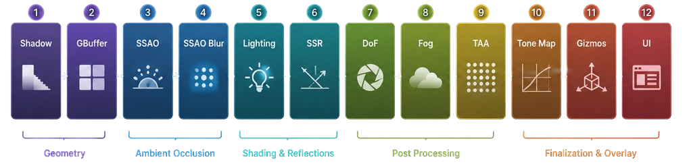

# BitForge

EDIT : New repository for the BitForge project, because the original was deleted by a miss manipulation of Git, this is the new repository for the project :(

📊 [**Project presentation (Google Slides)**](https://docs.google.com/presentation/d/1SG5pgmxKgExa6IxlRyvqw_RflE-PIy-k95eL4XF4HJk/edit?usp=sharing)

---

## Table of contents

1. [Introduction - What's BitForge?](#1-introduction--whats-bitforge)
2. [Architecture - General pipeline flow](#2-architecture--general-pipeline-flow)
3. [Rendering - The rendering pipeline](#3-rendering--the-rendering-pipeline)
4. [Optimization - Make code great again](#4-optimization--make-code-great-again)
5. [Problems faced & solutions](#5-problems-faced--solutions)
6. [Demo](#6-Demo)
7. [Project structure](#7-project-structure)
8. [Building & controls](#8-building--controls)
9. [Roadmap - What's next?](#9-roadmap--whats-next)

---

## 1.What's BitForge?

BitForge is a graduation capstone exploring how far a renderer can be pushed when built **from the metal up** - starting in assembly and layering modern graphics techniques on top. It is a deliberately **multi-language** project: low-level windowing in **MASM x86**, engine and application logic in **C++20 (with modules)**, and shading in **HLSL**.

### Timeline

| Period | Milestone |
|---|---|
| **October** | Kickoff - start in MASM x86 assembly |
| **December** | Milestone 1 |
| **January** | DirectX 12 integration - Milestone 2 |
| **February** | Rendering pipeline implementation |
| **March** | (Laptop repair) |
| **April** | Optimization |
| **May-June** | Milestone 3 |

### Key features

- **Assembler implementation** - the Win32 window is created and pumped from hand-written x86 assembly.
- **DirectX 12 integration** - a deferred, GPU-driven renderer built on bindless descriptors and indirect drawing.
- **Multi-language approach** - Assembler + C++20 modules + HLSL working together in one build.

Resources referenced span various graphics authors from **2014-2025** (plus a healthy amount of Google).

---

## 2.General pipeline flow

### Overview & code flow

The application boots through a small, layered stack - assembly at the bottom, C++ modules on top:

```
HelperWindow.asm  (MASM)   window-procedure helpers
RenderWindow.asm  (MASM)   Win32 window class + message loop
       |
Window.ixx        (C++20 module: bf.Window)   thin C++ wrapper over the asm window
       |
main.cpp          (C++20)  composition root: create window, init renderer, run frame loop
```

`main.cpp` is intentionally tiny - it centers and creates the window, initializes the `Dx12Renderer`, loads the scene, and runs the frame loop. Everything else lives behind clean module/class boundaries (the renderer, the preset system, the asset pipeline).

### Pros & cons of the design

| Pros | Cons / trade-offs |
|---|---|
| Full control from the assembly window up | Windows / x64-only |
| Bindless + GPU-driven keeps CPU draw cost minimal | Deferred rendering can't use hardware MSAA (solved with TAA) |
| Modular render graph - passes are reorderable callbacks | Higher G-buffer memory/bandwidth cost |
| C++20 modules give clean compilation boundaries | Module + assembly toolchain needs careful build setup |

---

## 3. Rendering pipeline

BitForge is a **deferred** engine: geometry is rasterized **once** into a set of textures (the G-buffer), then every later stage is a full-screen pass that reads those textures. Each frame the **render graph** executes an ordered list of passes:



```
Shadow -> GBuffer -> SSAO -> SSAOBlur -> Lighting -> SSR -> DoF -> Fog -> TAA -> ToneMap -> Gizmo -> UI -> Present
```

Only **Shadow** and **GBuffer** draw geometry; after that, **everything is screen-space** and stays in **linear HDR** until the final tone-map.

```
[ Shadow ]  [ GBuffer ]          <- producers (draw geometry)
      |           |
      +-----+-----+
            v
        Lighting                  <- reads G-buffer + shadow map + AO
            v
   SSR -> DoF -> Fog -> TAA       <- screen-space HDR effects
            v
        ToneMap -> Gizmo -> UI -> Present
```

### Deferred rendering - the Render Graph

Passes are `std::function` callbacks that share a `RenderContext` (command list, view/projection, camera). This makes the pipeline **modular**: passes can be reordered, toggled, or added without touching the others. The graph is the backbone everything else plugs into.

### Shadow mapping

A single **directional shadow map** (2048×2048, `D32` via an `R32_TYPELESS` resource with separate depth + sampling views). The Shadow pass renders scene depth **from the sun's point of view**; lighting and fog then sample it. Per-pixel shadowing uses **3×3 PCF** with a depth bias to remove self-shadow acne. The light's orthographic matrix is derived from the scene bounds and shared with the lighting shader.

### Geometry Buffer (G-buffer)

Four render targets in `R16G16B16A16_FLOAT` plus a `D32` depth buffer:

| Target | Contents |
|---|---|
| 0 | World **position** (`.w` = "geometry present" flag) |
| 1 | World **normal** |
| 2 | **Albedo** |
| 3 | **Material** (metallic / roughness / AO) |

The geometry pass writes these and does *no* lighting. Later passes **sample** them to recover the visible surface - so lighting runs once per visible pixel, and the buffers are reused across the whole post chain (SSAO, SSR, fog, DoF, TAA all read from them).

### Screen-Space Ambient Occlusion (& Blur)

Two passes: a **generate** pass samples a 64-point **hemisphere kernel** (randomly rotated by a tiled 4×4 noise texture) against G-buffer depth/normal to estimate contact occlusion, then a **depth-aware blur** removes the noise without bleeding across edges. The result darkens **only the ambient term** of lighting - direct light and shadows stay crisp.

### Lighting & Image-Based Lighting (IBL)

A full-screen pass runs **Cook-Torrance PBR** (GGX + Smith + Schlick), with a metallic/roughness workflow and up to 128 directional/point/spot lights from a structured buffer. Directional lights sample the shadow map.

**IBL is analytic - there is no cubemap.** The "environment" is computed by formula: a procedural sky (`EnvSky`) stands in for the reflection map, a hemisphere irradiance (`EnvIrradiance`) for the diffuse map, and an analytic BRDF approximation replaces the lookup texture. Reflections blur with roughness, ambient is scaled by AO + SSAO, and everything tints with time of day - at zero texture cost.

### Screen-Space Raycast reflections (SSR)

A reflection ray is **marched forward in small steps**; at each step it projects to screen space and checks the G-buffer depth to detect when it crosses behind a surface. On a hit, the already-lit color is pulled back, weighted by Fresnel and smoothness. Cheap (reuses the G-buffer, no ray-tracing acceleration structure) with the inherent limit that only on-screen geometry can be reflected.

### Volumetric Fog

Ray-marched participating media with **Henyey-Greenstein anisotropic scattering** and **shadow-map sampling** for god-rays / light shafts. Density, height falloff, anisotropy, step count, and color are all adjustable.

### Temporal Anti-Aliasing (TAA)

The engine's anti-aliasing solution (deferred can't use MSAA cleanly): **Halton sub-pixel jitter** each frame, **motion-vector reprojection** of the previous frame (history ping-pongs between two HDR targets), and **neighborhood clamping** to reject ghosting - stabilizing the entire image.

### Tone mapping & HDR output

Everything after lighting works in **linear HDR float**; the final pass compresses to the 8-bit backbuffer with a selectable operator (**None / Reinhard / ACES / AgX**) plus camera exposure.

---

## 4. Optimization

### SIMD implementation

Hot math is vectorized with **DirectXMath** compiled for **AVX2 + FMA** (`/arch:AVX2`, fast floating point). Batched vector/matrix operations and scene-bounds (AABB) accumulation live in **`Core/MathSimd.h`** and are used throughout **`Dx12Renderer.cpp`** and the camera - one instruction processing 4-8 floats at a time.

### GPU-driven vs CPU-driven processing

| CPU-driven (classic) | GPU-driven (BitForge default) |
|---|---|
| CPU loops over objects, one draw call each | CPU issues **one** `ExecuteIndirect` |
| Per-object buffer binds | **Unified** vertex/index buffers bound once |
| Draw cost scales with object count | GPU walks a command buffer and draws everything |

At load time, every mesh is merged into one **unified vertex buffer** + **unified index buffer**, with per-object data in an **instance buffer** and per-draw parameters in an **indirect command buffer**. A single `ExecuteIndirect` (driven by a command signature) renders the whole scene - minimal CPU involvement.

```
CPU: "draw everything" (1 call) --> GPU reads command buffer --> draws all meshes --> G-buffer
```

Other optimization angles: a multithreaded **async asset pipeline** (worker threads decode textures / parse glTF off the main thread) and **bindless** descriptors so the lighting pass binds the G-buffer + shadow + light buffers in a single table.

---

## 5. Problems faced & solutions

The interesting part of a renderer is rarely the happy path. These are real problems I hit building BitForge, why they were hard, and what I did about them.

### Deferred rendering has no usable MSAA

**Problem.** Hardware multisampling does not work on a deferred G-buffer the usual way (you can't meaningfully average position/normal/material samples), so the image aliased badly on edges.

**Solution.** I implemented **Temporal Anti-Aliasing**: Halton sub-pixel jitter on the projection each frame, motion-vector reprojection of the previous frame from a ping-pong history buffer, and neighborhood color clamping to reject ghosting. This trades a per-frame jitter for a stable, anti-aliased image without MSAA, and doubles as the stabilizer for the noisy SSAO/SSR passes.

### CPU draw calls were the bottleneck, not the GPU

**Problem.** The naive path issued one draw call (and buffer rebind) per mesh. With Sponza that is hundreds of CPU-side calls per frame, and the CPU, not the GPU, capped the frame rate.

**Solution.** I rebuilt the geometry path to be **GPU-driven**: every mesh is merged into one unified vertex and index buffer at load time, per-object data goes into an instance buffer, and per-draw parameters into an indirect command buffer. The whole scene then renders from a **single `ExecuteIndirect`**. CPU draw submission went from "per object" to "once."

```
Before:  for each mesh -> bind buffers -> draw      (hundreds of CPU calls)
After:   bind unified buffers once -> ExecuteIndirect  (1 CPU call)
```

### Wireframe and backface-cull silently did nothing in GPU-driven mode

**Problem.** After moving to indirect rendering, the UI's Wireframe and Backface-Cull toggles stopped working. The cause: the indirect path bound a single hard-coded PSO (solid fill, cull none), while only the old CPU path had state variants.

**Solution.** I generated **2x2 PSO variants `[fill][cull]`** for the indirect pipeline (built in a nested loop) and selected `m_indirectGbufferPsoVariant[wireframe][backfaceCull]` at draw time, so both toggles behave identically in either rendering mode.

### C++20 modules + the STL: a double-definition wall

**Problem.** Building the preset system as C++20 modules, the implementation units would not compile: dozens of `C2572 "redefinition of default argument"` errors deep inside `<type_traits>`. The trigger was a module implementation unit textually including the STL (via `json.hpp`) while its module interface also made `std::string` reachable, so the standard library was defined twice in one translation unit.

**Solution.** I made every preset module **interface std-free** (they exchange `const char*` and a plain `ScenePreset` struct, not `std::string`/`std::vector`), and confined all STL and JSON usage to the `.cpp` implementations. This mirrors how the project's `bf.Window` module already worked and removed the collision entirely.

### The shader edit that "did nothing"

**Problem.** I added a shadow-map debug view, edited the shader, rebuilt, and saw no change. I spent real time convinced the shader logic was wrong.

**Solution.** The actual cause was the asset layout: the executable compiles shaders at runtime from its **own directory** (`x64/<Config>/assets/shaders`), but I was editing a second copy in `WorkDirectory`. There were three un-synced copies. I added a **post-build copy step** so `WorkDirectory/Assets` is the single source of truth and is mirrored next to the executable on every build (incremental, skips unchanged files). The "edited the wrong copy" class of bug is now impossible.

### Release build linked but crashed / failed on `WinMain`

**Problem.** The app uses `int main()`, but the Release configuration (Windows subsystem) expected `WinMain`, producing an unresolved-symbol link error, and LTCG made incremental builds unreliable.

**Solution.** I forced the CRT entry point to `mainCRTStartup` (`<EntryPointSymbol>` in the Release config) so the Windows subsystem calls `main()` with no console window, and adopted **Rebuild** over incremental for the LTCG + C++20-module configuration.

### Why only 128 lights (a deliberate trade, not a bug)

**Problem / decision.** The lighting pass loops over every light for every pixel with no culling, so cost grows linearly with light count. I needed a sane budget.

**Solution.** I capped the light buffer at **128** as an honest budget for an un-culled single-pass deferred renderer, and documented that scaling to thousands would require tiled or clustered lighting. This is recorded as a known limitation rather than hidden, and it is a clean future-work item on the roadmap.

### Assembler: the Win64 calling convention and shadow space

**Problem.** The window is created from hand-written MASM x86-64. Every Win32 call (`RegisterClassExW`, `CreateWindowExW`, `GetModuleHandleW`, ...) must follow the Windows x64 ABI: the first four arguments go in `rcx, rdx, r8, r9`, the caller must reserve **32 bytes of shadow space**, and the stack must be 16-byte aligned at the call. Getting any of this wrong does not warn at assemble time, it just crashes at runtime.

**Solution.** I gave every procedure a disciplined prologue (`sub rsp, 40h` / `sub rsp, 20h`) that both reserves shadow space and keeps alignment, and I spill incoming register arguments into that shadow space (`mov [rsp+20h], rcx`, etc.) before making nested calls that would clobber the volatile registers. The window class, creation, message pump, and cleanup are all built on this convention.

### Assembler: no `windows.h`, so types and strings are built by hand

**Problem.** MASM has no Windows headers. There is no `WNDCLASSEXW`, no `MSG`, no `IDC_ARROW`, and no easy wide-string literal, yet the Unicode `*W` APIs require all of them with exact memory layout.

**Solution.** I maintain a custom `windows.inc` with the struct definitions and constants, zero `WNDCLASSEXW` with `rep stosb` and fill it field by field, and build UTF-16 strings manually as word arrays (`className DW 'M','y',' ','C','l','a','s','s', 0`) so they are valid wide strings for `RegisterClassExW` / `CreateWindowExW`.

### Assembler: a render loop cannot block on the message queue

**Problem.** The classic `GetMessageW` loop **blocks** until a message arrives. That is fine for a passive app, but a renderer must run every frame regardless of input, so a blocking pump would freeze rendering.

**Solution.** I split the window into small public procedures (`ProcessMessages`, `IsWindowOpen`, `DrawWindow`) built on **`PeekMessageW`** instead of `GetMessageW`, so the C++ frame loop can pump messages non-blocking, check whether the window is still open, and render, all in the same tick.

### Assembler: accepting arguments by value or by pointer from C++

**Problem.** Depending on how the C++ side calls in, window parameters (width, height, x, y) could arrive as raw values or as pointers, and the assembly entry point needs to handle both without duplicating the whole routine.

**Solution.** I exposed two thin entry points that share one implementation: `InitWindowValue` jumps straight to the core routine, while `InitWindowRef` first dereferences `rcx/rdx/r8/r9` (`mov rcx, [rcx]` ...) and then falls through to the same code. One implementation, two ABIs.

### Assembler: linking MASM with C++20 modules and handing off the HWND

**Problem.** The engine began entirely in assembly, but D3D12 lives in C++. The two halves have to share data and functions across the MASM/C++ boundary, and the renderer ultimately needs the window handle.

**Solution.** I defined an explicit symbol contract with `PUBLIC`/`EXTERN` for both data (`g_bgcolor`, `className`, `windowClass`) and functions (`RegisterWindowClass`, `CreateWin`, `WinProc`), wired the `.asm` files into the build via the MASM target, and exposed `InitWindowHandle` / `GetWindowHandle` so the **`bf.Window`** C++20 module can wrap the assembly window and pass a clean `HWND` to `Dx12Renderer::Initialize`.

---

## 6. Demo

> See the [project presentation](https://docs.google.com/presentation/d/1SG5pgmxKgExa6IxlRyvqw_RflE-PIy-k95eL4XF4HJk/edit?usp=sharing) for the full walkthrough and demo.

The default scene is **Sponza** with PBR materials, dynamic sun + point lights, and the full effect chain enabled. At runtime you can:

- Fly the cinematic camera (physical FOV, exposure triangle, DoF, shake).
- Toggle every effect and tweak it live via the Dear ImGui overlay (**F1**).
- Inspect the pipeline through the **G-Buffer View** dropdown (position, normal, albedo, metallic, roughness, IBL irradiance, SSAO, SSR ray-hits/reflections, **shadow map**).
- Select and edit lights by clicking their 3D gizmos (ray-sphere picking).
- Save / load / cycle engine configurations with the **preset system** (JSON, F5/F6/F7).

---

## 7. Project structure

```
BitForge/                  (solution root)
|- BitForge/               (the project)
|  |- Main.cpp             <- entry point only (window/scene setup + loop)
|  |- Renderer/            <- Dx12Renderer + Init/Pipeline/Resources/Deferred
|  |- Rendering/           <- render passes & systems
|  |  |- Deferred/  Shadows/  Lighting/  GpuDriven/  Materials/
|  |  |- PostProcess/  SSAO/  TAA/  VolumetricFog/  Graph/  Debug/
|  |- Camera/              <- cinematic camera
|  |- Assets/              <- async asset manager, loaders, streaming, cache
|  |- Config/Presets/      <- preset module system (bf.Preset.*)
|  |- Scene/               <- time of day, scene lighting setup
|  |- Core/                <- timer, SIMD math (MathSimd.h), Vertex
|  |- Input/  UI/          <- input + ImGui layer
|- WorkDirectory/          <- source assets + MASM sources
|  |- Assets/              <- Shaders/, Models/, Sponza/, Textures/
|  +- *.asm                <- RenderWindow.asm, ASMWindow.asm, ASMWindowHelper.asm, ASMColor.asm
|- lib/Window/             <- bf.Window C++20 module (IXX/ + CPP/)
+- x64/<Config>/           <- build output (exe + copied Assets/)
```

`WorkDirectory/Assets` is the **single source of truth** for shaders and models; a post-build step copies it next to the executable. Shaders are compiled from `.hlsl` at runtime via `D3DCompileFromFile`.

---

## 8. Building & controls

**Requirements:** Windows 10/11 with a D3D12 GPU · Visual Studio 2022/2025 (v143+ toolset) with the **Desktop C++** workload + **MASM** · Windows 10 SDK.

**Build:**

1. Open `BitForge.slnx`, select **x64** + **Debug** or **Release**.
2. **Build** (Ctrl+Shift+B) - the post-build step copies `WorkDirectory/Assets` next to the exe.
3. Run.

```powershell
msbuild BitForge\BitForge.vcxproj /t:Rebuild /p:Configuration=Release /p:Platform=x64 /p:SolutionDir=<repo>\
```

> Release uses Whole Program Optimization + C++20 modules - prefer **Rebuild** for correctness. After editing a shader, do a **Build** so the runtime copy refreshes.

**Controls:**

| Input | Action |
|---|---|
| **W A S D** (Z/Q too) | Move camera |
| **Right-mouse drag** | Look around |
| **Esc** | Quit |
| **F1** | Toggle debug UI |
| **F5 / F6** | Quick-save / quick-load preset |
| **F7** | Cycle saved presets |
| Click a light gizmo | Select & edit that light |

---

## 9. Roadmap - What's next?

**Engine & architecture**
- Cleaner DirectX implementation and architecture refactoring
- Deeper raycast-based system integration
- Continued SIMD optimization
- Model/texture integration scaling toward **1,000+ objects**
- Full scene completion with PBR rendering

**Visual & simulation features**
- Improved visual fidelity
- Collision systems
- Skeletal animation
- Physics integration

**Editor / tooling**
- **Qt viewport** integration
- Viewport + hierarchy tools
- Profiler assistance
- Gizmo systems
