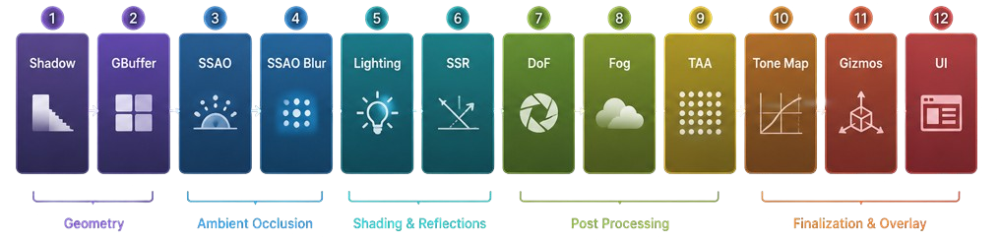

# BitForge

> New repository — the original was lost to a Git mishap.

📊 [**Project presentation (Google Slides)**](https://docs.google.com/presentation/d/1SG5pgmxKgExa6IxlRyvqw_RflE-PIy-k95eL4XF4HJk/edit?usp=sharing)

A graduation capstone renderer built **from the metal up**: Win32 windowing in hand-written **MASM x86-64**, engine and app logic in **C++20 modules**, shading in **HLSL**. On top of that sits a deferred, GPU-driven **DirectX 12** renderer with a full post-process chain.

---
## Architecture

```
HelperWindow.asm / RenderWindow.asm   (MASM)   window class, WndProc, message pump
        |
Window.ixx  (C++20 module: bf.Window)          thin wrapper over the asm window
        |
main.cpp                                       create window, init renderer, frame loop
```
## Rendering pipeline

Geometry is rasterized **once** into a G-buffer; every later stage is a full-screen pass reading those textures. Everything stays in **linear HDR** until the final tone-map.


```
Shadow -> GBuffer -> SSAO -> SSAOBlur -> Lighting -> SSR -> DoF -> Fog -> TAA -> ToneMap -> Gizmo -> UI -> Present
```
Passes are `std::function` callbacks sharing a `RenderContext`, so they can be reordered, toggled or added independently

- **Shadows** : one 2048² directional map (`D32`), 3×3 PCF with depth bias; ortho matrix derived from scene bounds
  
- **G-buffer** : four `R16G16B16A16_FLOAT` targets + `D32` depth: world position (`.w` = geometry flag), world normal, albedo, material (metallic/roughness/AO)
  
- **SSAO** : 64-point hemisphere kernel rotated by 4×4 noise, then a depth-aware blur. Darkens only the ambient term
  
- **Lighting** : Cook-Torrance PBR (GGX + Smith + Schlick), up to 128 lights from a structured buffer. **IBL is analytic, no cubemap**: procedural sky for reflections, hemisphere irradiance for diffuse, approximated BRDF — zero texture cost
  
- **SSR** : forward ray-march, projecting each step to screen space and testing G-buffer depth; hits pull back already-lit color weighted by Fresnel and smoothness. Only on-screen geometry reflects
  
- **Volumetric fog** : ray-marched media with Henyey-Greenstein scattering and shadow-map sampling for god-rays
  
- **TAA** : Halton jitter, motion-vector reprojection from a ping-pong history, neighborhood clamping against ghosting
  
- **Tone map** : None / Reinhard / ACES / AgX + camera exposure
  
---
## Optimization

**SIMD** : hot math via DirectXMath built for AVX2 + FMA (`/arch:AVX2`); batched vector/matrix ops and AABB accumulation in `Core/MathSimd.h`

**GPU-driven geometry** : at load time all meshes merge into one unified vertex + index buffer, per-object data into an instance buffer, per-draw params into an indirect command buffer. The whole scene renders from a **single `ExecuteIndirect`**
```
Before:  for each mesh -> bind buffers -> draw   (hundreds of CPU calls)
After:   bind once -> ExecuteIndirect            (1 CPU call)
```
Also: multithreaded async asset pipeline (texture decode / glTF parsing off the main thread) and bindless descriptors so lighting binds everything in one table
---
## Problems faced & solutions

**No usable MSAA in deferred**  you can't average position/normal/material samples. Solved with TAA, which doubles as the stabilizer for noisy SSAO/SSR

**CPU draw calls were the bottleneck**  one draw + rebind per mesh capped the frame rate on Sponza. Rebuilt the geometry path as GPU-driven (see above)

**Wireframe / backface-cull silently did nothing** the indirect path bound one hard-coded PSO. Generated 2×2 PSO variants `[fill][cull]` and selected per draw

**C++20 modules + STL double definition** dozens of `C2572` errors inside `<type_traits>`, caused by a module implementation unit textually including the STL (via `json.hpp`) while its interface also exposed `std::string`. Fixed by making preset module interfaces std-free (`const char*` + a plain `ScenePreset` struct) and confining STL/JSON to the `.cpp` files

**The shader edit that "did nothing"** three un-synced asset copies; the exe compiles shaders from its own directory. Added a post-build copy step making `WorkDirectory/Assets` the single source of truth.

**Release crashed on `WinMain`** Windows subsystem expected `WinMain` for an `int main()` app. Forced `mainCRTStartup` via `<EntryPointSymbol>`, and use Rebuild with LTCG + modules

**Only 128 lights** a deliberate budget: the lighting pass is un-culled, so cost scales linearly. Tiled/clustered lighting is future work

### Assembly-specific

- **Win64 ABI** args in `rcx/rdx/r8/r9`, 32 bytes of shadow space, 16-byte stack alignment. Mistakes don't warn, they crash. Every proc gets a disciplined prologue (`sub rsp, 40h`/`20h`) and spills register args before nested calls
  
- **No `windows.h`** a custom `windows.inc` holds the struct definitions and constants; `WNDCLASSEXW` is zeroed with `rep stosb` and filled field by field, and UTF-16 literals are built as word arrays
  
- **Non-blocking pump** `GetMessageW` blocks, which would freeze rendering. Split into `ProcessMessages` / `IsWindowOpen` / `DrawWindow` built on `PeekMessageW`
  
- **Two ABIs, one implementation** `InitWindowValue` jumps straight to the core routine; `InitWindowRef` dereferences `rcx/rdx/r8/r9` first and falls through
  
- **MASM ↔ C++ handoff** explicit `PUBLIC`/`EXTERN` contract for data and functions, plus `InitWindowHandle`/`GetWindowHandle` so `bf.Window` can pass a clean `HWND` to `Dx12Renderer::Initialize`
---
## Demo
Default scene is **Sponza** with PBR materials, dynamic sun + point lights and the full effect chain. At runtime you can fly the cinematic camera (physical FOV, exposure triangle, DoF, shake), toggle and tweak every effect in the ImGui overlay, inspect any stage through the **G-Buffer View** dropdown, click light gizmos to edit them, and save/load/cycle JSON presets
---
## Controls

| Input | Action |
|---|---|
| **W A S D** (Z/Q too) | Move camera |
| **Right-mouse drag** | Look around |
| **Esc** | Quit |
| **F1** | Toggle debug UI |
| **F5 / F6 / F7** | Quick-save / quick-load / cycle presets |
| Click a light gizmo | Select & edit that light |
